# Hey, I'm Teekayu 👋

### Full Stack Developer • Creative Engineer • UX-driven Builder

I build fast, scalable, and interactive web experiences with strong attention to:

- ⚡ Performance & SEO
- 🎨 Motion UI / Interactive Experience
- 🧠 Scalable Architecture
- 🚀 Full Stack Engineering
- ✨ Frontend Experience & Micro Interaction

Currently working at **Thairath News Agency** as a Full Stack Developer.
And working at **Colab Cooperate (Web Agency)** as a Co-Founder/Full Stack Developer.

---

## Core Stack

### Frontend

### Backend & Infrastructure

### Creative Development

---

## Engineering Focus

- High-performance frontend architecture
- Queue systems & distributed workers
- Advanced Next.js patterns
- UX engineering & interaction systems
- Motion-driven web experiences
- SEO-oriented platforms
- Scalable API systems
- Realtime applications

---

## Currently Exploring

- BullMQ & distributed job processing
- Kubernetes & containerized deployment
- Edge rendering & caching strategies
- Web animation systems
- AI-assisted workflow tooling

---

## Stats

---

## Connect

- 🌐 Portfolio: https://creaml4tt3.me
- 🖤 GitHub: https://github.com/Creaml4tt3

---

> Build things that feel fast, alive, and unforgettable.
